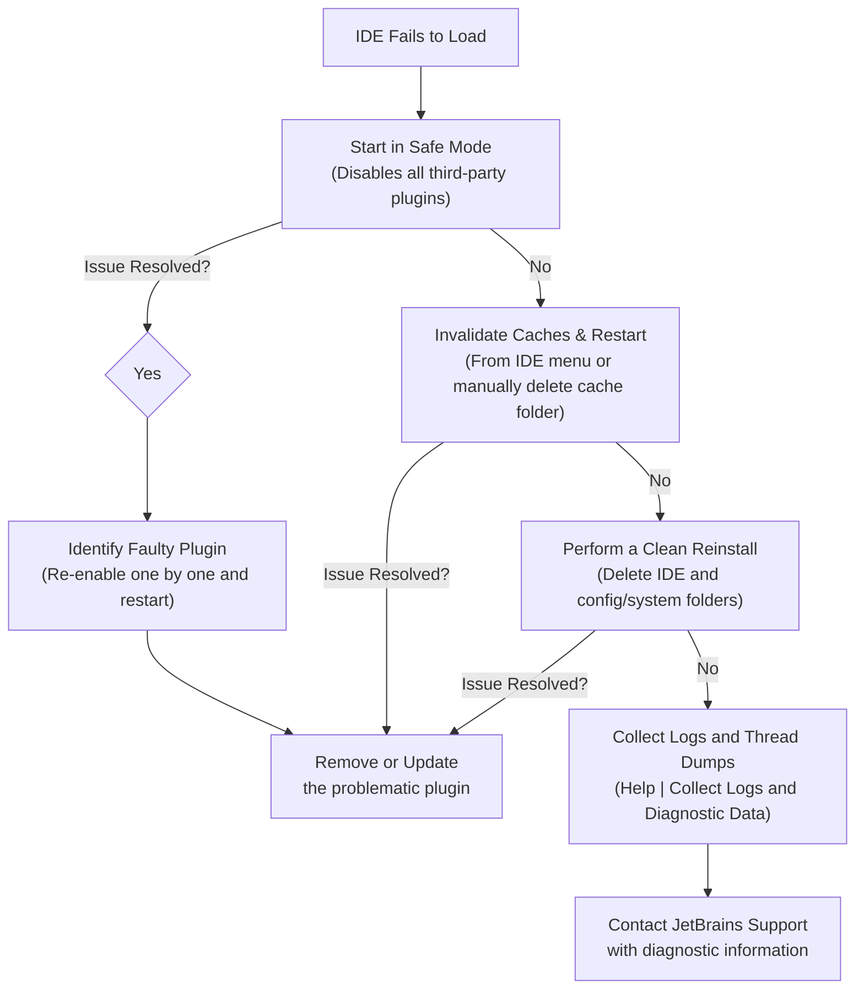

# IDE Troubleshooting

## Overview

This skill provides a structured workflow for diagnosing and resolving common issues that prevent JetBrains IDEs (like IntelliJ IDEA, PyCharm, etc.) from starting or functioning correctly. It focuses on a systematic process of elimination, starting with the most common and easily fixable causes, such as plugin conflicts and corrupted caches.

## Diagnostic Workflow

The troubleshooting process follows these sequential steps. Do not skip steps, as they are ordered from most likely to least disruptive.

1.  **Isolate Plugin Conflicts**: The most common cause of IDE startup failure is a faulty or incompatible third-party plugin. Start by disabling all non-bundled plugins.
2.  **Clear Corrupted Caches**: If disabling plugins does not resolve the issue, the next step is to clear the IDE's local caches, which can become corrupted and cause freezes.
3.  **Perform a Clean Reinstall**: As a last resort, a complete reinstallation, including the manual removal of all configuration and system files, ensures a clean state.
4.  **Gather Diagnostic Information**: If the issue persists, gather detailed logs and thread dumps for further analysis or for reporting to JetBrains support.

This workflow is visualized in the diagram below:

## Detailed Steps

### 1. Isolate Plugin Conflicts

-   **Action**: Instruct the user to restart the IDE in **Safe Mode**. This can usually be done via a command-line flag or a script provided by the IDE. If Safe Mode is not available, guide the user to manually disable all downloaded plugins via `Settings/Preferences > Plugins > Installed` and restart.
-   **If Resolved**: The issue is a plugin conflict. Instruct the user to re-enable plugins one by one (or in small groups) and restart the IDE after each change to identify the faulty plugin.
-   **Reference**: For a list of plugins known to cause issues, consult the reference file: `/home/ubuntu/skills/ide-troubleshooting/references/common-plugin-conflicts.md`

### 2. Clear Corrupted Caches

-   **Action**: Guide the user to use the **File | Invalidate Caches...** action from the main menu. Instruct them to select all available options and restart the IDE.
-   **Alternative**: If the IDE does not start at all, provide the user with the path to the cache directory for their operating system so they can delete it manually. These paths can be found in the JetBrains documentation.

### 3. Perform a Clean Reinstall

-   **Action**: If the above steps fail, recommend a full reinstallation.
    1.  Uninstall the IDE using the standard operating system procedure.
    2.  Manually delete the IDE's configuration, system, and plugin directories to ensure no corrupted files remain. Provide the default paths for these directories.
    3.  Download and install a fresh copy of the IDE from the JetBrains website.

### 4. Gather Diagnostic Information

-   **Action**: If the problem persists even after a clean reinstall, the issue is likely more complex. Guide the user to collect diagnostic data.
    -   **IDE Logs**: Use the **Help | Collect Logs and Diagnostic Data** action to create a zip archive of all relevant log files.
    -   **Thread Dumps**: If the IDE is frozen, instruct the user on how to generate a thread dump using system tools (`jstack` for Java processes) to capture the state of all threads.
-   **Next Step**: Advise the user to create a support ticket with JetBrains and attach the collected diagnostic data.
